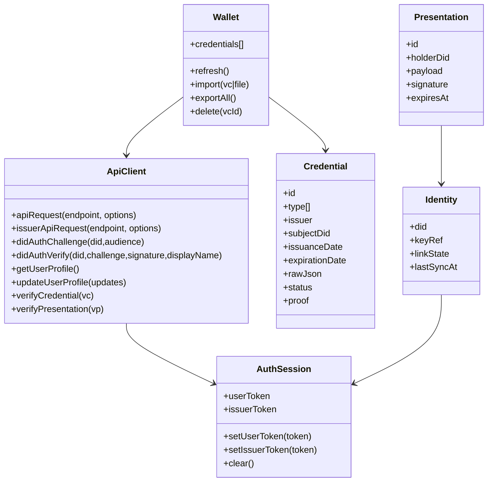
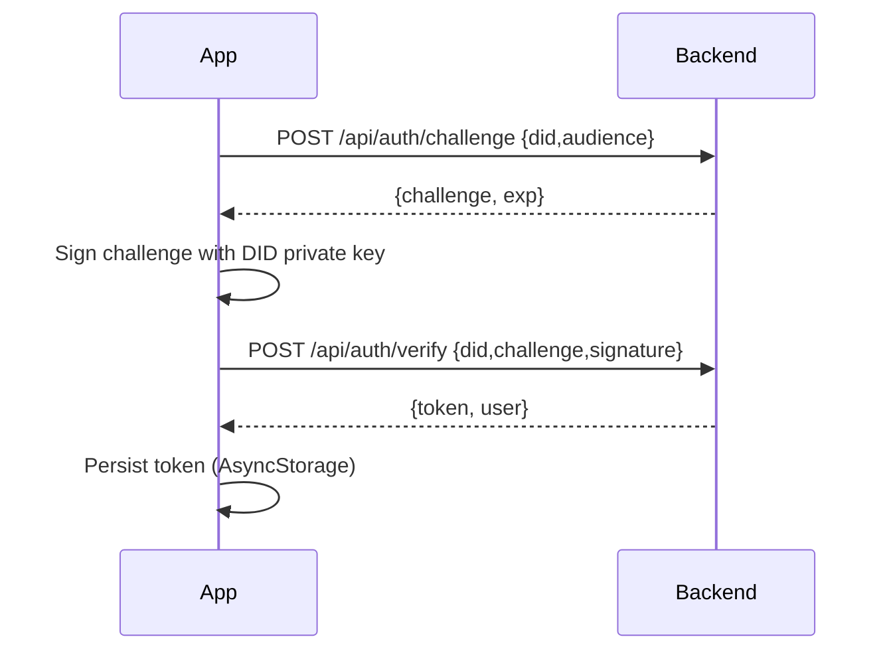
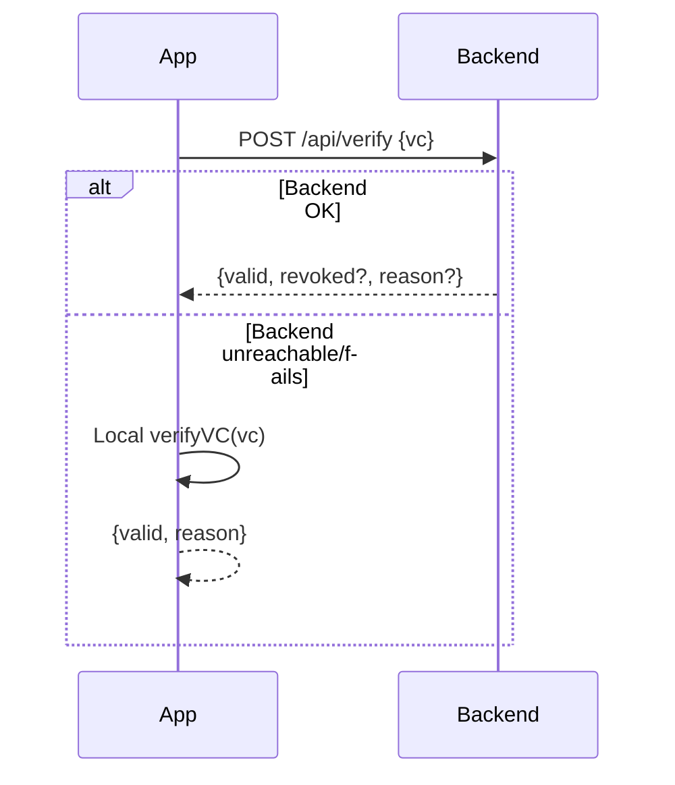

# WorldPass Mobile — Requirements Analysis (v1)

This document captures functional requirements, non-functional requirements, data model, and diagrams for the **WorldPass Mobile** app (Expo / React Native) based on the current implementation in `worldpass-mobile/` plus existing project docs.

## 1) Scope

### In scope (current / intended MVP)
- User wallet for Verifiable Credentials (VCs): store, view, import/export, delete.
- DID-based authentication: challenge/verify and linking DID to account.
- Credential verification: QR/NFC/manual JSON; backend-first, offline fallback.
- Credential presentation: select credential + fields, share via QR/NFC (some parts simulated).
- Issuer flow in-app (token-based): register/login, profile, templates, credential list.
- User profile + profile-data editing.
- 2FA (TOTP) setup/enable/disable.
- Payments: create intent + list transactions.
- Offline mode basics: allow local verification + local wallet operations; sync when online.

### Explicitly out of scope (for this doc)
- Web admin panel requirements (covered elsewhere).
- Full “production-grade” NFC/BLE implementations (currently partially simulated).
- Full decentralized identity key management hardening (this doc specifies it as a requirement).

## 2) Actors & Roles

- **Holder/User**: owns DID, holds VCs, presents proofs to verifiers.
- **Verifier**: requests proofs and verifies VCs/presentations.
- **Issuer**: issues VCs; manages templates and issuance history.
- **Backend/API**: verifies signatures, checks revocation/status, stores user/issuer data.
- **Device OS**: secure storage, camera, NFC, file system, connectivity.

## 3) Business Goals

- Make VCs usable in real life: receive, store, and present quickly.
- Allow verification even when the backend is unreachable (offline verification fallback).
- Provide a path for issuers to onboard and manage issuance from mobile.

## 4) Functional Requirements

### 4.1 Authentication & Identity

**FR-AUTH-1 (DID auth challenge/verify)**
- The app must request an auth challenge for a DID and audience.
- The app must sign the challenge with the DID private key and submit verification.
- On success, the app must persist a session token for subsequent API calls.

Implementation signals:
- `POST /api/auth/challenge` and `POST /api/auth/verify` via `worldpass-mobile/src/lib/api.js`.
- Token stored as `AsyncStorage['user_token']`.

**FR-AUTH-2 (DID linking)**
- The app must be able to link a DID to a user account.
- The app should attempt re-linking / re-sync when identity exists and connectivity is available.

Implementation signal:
- `POST /api/user/did-link`.

**FR-AUTH-3 (Multi-token separation)**
- The app must maintain separate tokens for:
  - User session (`user_token`)
  - Issuer session (`issuer_token`)
- Tokens must not be mixed across endpoints.

**FR-AUTH-4 (Logout)**
- The app must provide a way to clear session tokens and local sensitive state.

### 4.2 Wallet (VC Storage)

**FR-WALLET-1 (List VCs)**
- The app must display a list of credentials in the wallet.
- Each credential entry must show at minimum: type, issuer label, issuance date.

**FR-WALLET-2 (View VC details)**
- The app must show key VC fields (types, issuer, issuance/expiration, subject DID, proof/status/context summary).

**FR-WALLET-3 (Delete VC)**
- The app must allow deletion of a credential.
- Deletion should remove it locally and, when online, from the server wallet.

Implementation signals:
- `GET /api/user/vcs`, `DELETE /api/user/vcs/{vc_id}`.

**FR-WALLET-4 (Import VCs)**
- The app must allow importing VCs from:
  - A JSON file
  - A pasted JSON string
  - Potentially a share token / QR flow

**FR-WALLET-5 (Export VCs)**
- The app must allow exporting:
  - A single VC to a file
  - All wallet credentials to a JSON payload

Implementation signal:
- `POST /api/vc/export`.

### 4.3 Verification

**FR-VERIFY-1 (Verify VC via backend)**
- The app must allow verifying a VC JSON using the backend.
- Backend verification must be attempted first when online (for revocation/status checks).

Implementation signal:
- `POST /api/verify`.

**FR-VERIFY-2 (Offline VC verification fallback)**
- If backend verification fails (network/server), the app must attempt local cryptographic verification.
- Offline verification must clearly indicate it is offline and may not include revocation state.

Implementation signal:
- `verifyVC()` local crypto fallback in `worldpass-mobile/src/screens/VerifyScreen.js`.

**FR-VERIFY-3 (Input methods)**
- The app must allow obtaining a VC payload via:
  - QR scan (camera)
  - NFC receive
  - Manual paste/edit

### 4.4 Presentation (Sharing / Selective Disclosure)

**FR-PRESENT-1 (Select VC and fields)**
- The user must be able to select a VC and choose which `credentialSubject` fields to share.

**FR-PRESENT-2 (Generate share payload)**
- The app must generate a presentation/share payload based on selected fields.
- The payload should be signed by the user DID.

**FR-PRESENT-3 (Share via QR / NFC)**
- The app must support sharing the resulting payload via QR.
- NFC sharing is supported on Android; where not supported, the UI must communicate limitations.

Notes:
- Some NFC sharing in current screens is simulated; production requires native/higher-fidelity NFC flow.

**FR-PRESENT-4 (Verify presentation)**
- The app (or verifier-facing part) must be able to verify a presentation via the backend.

Implementation signal:
- `POST /api/present/verify`.

### 4.5 User Profile & Settings

**FR-PROFILE-1 (Read profile)**
- The app must load user profile from backend and display a derived friendly name.

Implementation signal:
- `GET /api/user/profile` and `GET /api/user/profile-data`.

**FR-PROFILE-2 (Update profile)**
- The app must update basic account fields and extended profile_data.

Implementation signal:
- `POST /api/user/profile` and `POST /api/user/profile-data`.

### 4.6 2FA (TOTP)

**FR-2FA-1 (Setup)**
- The app must be able to request a TOTP seed/QR setup payload.

**FR-2FA-2 (Enable/Disable)**
- The app must allow enabling/disabling 2FA by submitting an OTP code.

Implementation signals:
- `POST /api/user/2fa/setup`, `/enable`, `/disable`.

### 4.7 Payments

**FR-PAY-1 (Create payment intent)**
- The app must create a payment intent via backend.

**FR-PAY-2 (List transactions)**
- The app must list payment transactions, optionally filtered by status.

Implementation signals:
- `POST /api/payment/intent`, `GET /api/payment/transactions`.

### 4.8 Issuer Mode

**FR-ISSUER-1 (Register/Login)**
- The app must allow issuer registration and login.

**FR-ISSUER-2 (Issuer profile)**
- The app must allow reading/updating issuer profile.

**FR-ISSUER-3 (Templates)**
- The app must allow listing/creating/updating/deleting issuer templates.

**FR-ISSUER-4 (Issued credentials list + stats)**
- The app must allow listing issuer credentials (with query parameters) and viewing issuer stats.

Implementation signals:
- `/api/issuer/register`, `/api/issuer/login`, `/api/issuer/profile`, `/api/issuer/me`, `/api/issuer/stats`, `/api/issuer/credentials`, `/api/issuer/templates`.

## 5) Non-Functional Requirements (NFR)

### 5.1 Security
- **NFR-SEC-1**: Private keys for DID signing must be stored in platform-secure storage (Keychain/Keystore), not plain AsyncStorage.
- **NFR-SEC-2**: API tokens must be treated as secrets; avoid logging tokens.
- **NFR-SEC-3**: Require explicit user consent before exporting/sharing credentials.
- **NFR-SEC-4**: Implement basic anti-tamper & jailbreak/root detection as a best-effort (optional for MVP).
- **NFR-SEC-5**: Presentations must include replay protection (challenge/nonce + expiry).

### 5.2 Privacy
- **NFR-PRIV-1**: Minimize data shared by default (selective disclosure UI defaults to minimal set).
- **NFR-PRIV-2**: Clearly label what fields will be shared.

### 5.3 Reliability & Offline
- **NFR-OFF-1**: Wallet browsing and local verification must work offline.
- **NFR-OFF-2**: When online returns, background sync should retry pending operations (link DID, refresh wallet, etc.).
- **NFR-OFF-3**: The UI must clearly indicate online/offline state and which operations are degraded.

### 5.4 Performance
- **NFR-PERF-1**: Wallet list rendering must remain responsive at 200+ credentials (pagination/virtualization acceptable).
- **NFR-PERF-2**: QR verification should complete in <2s for typical payload size when offline.

### 5.5 Compatibility
- **NFR-COMP-1**: Android and iOS support; feature flags for NFC where unsupported.
- **NFR-COMP-2**: Expo Web should work for dev/testing (with limitations).

## 6) Data Model (Conceptual)

### Entities
- **UserAccount**: id, email, display_name, theme, phone, lang, otp_enabled, created_at
- **Identity (DID)**: did, keypair reference, linked_user_id, link_state, last_sync_at
- **Credential (VC)**: id/jti, raw_json, type[], issuer, subject_did, issuanceDate, expirationDate, status/revocation info
- **Presentation (VP)**: id, holder_did, derived payload, signature, created_at, expiry
- **IssuerAccount**: id, name, contact, status, token
- **Template**: id, name, schema/type, fields, version
- **PaymentTransaction**: id, status, amount, currency, provider_ref, created_at

### Local storage keys (current)
- `AsyncStorage['user_token']`
- `AsyncStorage['issuer_token']`
- DID is persisted via `getDID()`/storage util (see `worldpass-mobile/src/lib/storage`).

## 7) API Surface (Mobile Client)

From `worldpass-mobile/src/lib/api.js`:
- Auth: `POST /api/auth/challenge`, `POST /api/auth/verify`
- User: `GET/POST /api/user/profile`, `GET/POST /api/user/profile-data`, `POST /api/user/did-link`
- VC: `POST /api/verify`, `POST /api/vc/export`, `POST /api/user/vc/add`, `GET /api/user/vcs`, `DELETE /api/user/vcs/{vc_id}`
- Templates (user): `GET/POST /api/user/templates`, `PUT/DELETE /api/user/templates/{id}`
- Presentation: `POST /api/present/verify`
- Challenge: `POST /api/challenge/new`
- Share: `POST /api/share/token`, `GET /api/share/{token}`
- Payment: `POST /api/payment/intent`, `GET /api/payment/transactions`
- 2FA: `POST /api/user/2fa/setup`, `/enable`, `/disable`
- Issuer: `/api/issuer/register`, `/login`, `/profile`, `/me`, `/stats`, `/credentials`, `/templates`

Transport conventions:
- Uses `X-Token: <jwt>` header.
- Adds `X-Wallet-Did: <did>` header when available.
- Adds `expo-platform` header.

## 8) UX Flows (High Level)

### Onboarding
1) Create/import identity (DID)
2) Run DID auth challenge/verify
3) Link DID to user account
4) Land in tabs: Wallet / Present / Verify / Settings

### Verify
1) Scan QR or read NFC or paste JSON
2) Call backend verify
3) If backend fails: local verification
4) Show result with provenance (backend vs offline)

### Present
1) Choose VC
2) Choose fields
3) Sign presentation payload
4) Display QR / initiate NFC share

## 9) Diagrams (Mermaid)

### 9.1 Use-case Diagram

```mermaid
flowchart LR
  User((Holder/User))
  Verifier((Verifier))
  Issuer((Issuer))
  Backend[(WorldPass API)]

  User --> UC1[Create/Import DID]
  User --> UC2[DID Auth (Challenge/Verify)]
  User --> UC3[Link DID to Account]
  User --> UC4[Manage Wallet (List/View/Import/Export/Delete VCs)]
  User --> UC5[Present Credential (Selective Fields)]
  User --> UC6[Verify Credential (QR/NFC/JSON)]
  User --> UC7[Manage Profile]
  User --> UC8[Setup/Enable/Disable 2FA]
  User --> UC9[Payments (Intent/Transactions)]

  Issuer --> IC1[Register/Login]
  Issuer --> IC2[Manage Templates]
  Issuer --> IC3[List Issued Credentials]
  Issuer --> IC4[View Stats]

  Verifier --> VC1[Verify VC]
  Verifier --> VC2[Verify Presentation]

  UC2 --> Backend
  UC3 --> Backend
  UC4 --> Backend
  UC6 --> Backend
  UC9 --> Backend
  IC1 --> Backend
  IC2 --> Backend
  IC3 --> Backend
  VC1 --> Backend
  VC2 --> Backend
```

### 9.2 Class Diagram (Conceptual)



### 9.3 Sequence: DID Auth



### 9.4 Sequence: Verify VC (Backend-first)



## 10) MVP Acceptance Criteria (Checklist)

- User can create/import DID and authenticate (token persisted).
- User can link DID to backend account.
- Wallet shows credentials and supports import/export/delete.
- Verify tab can verify VC via QR scan and shows backend/offline provenance.
- Present flow can generate QR for selected fields.
- Settings can update profile and configure 2FA.
- Basic offline mode works: wallet browsing + offline verification.

## 11) Gaps / Risks Observed (from code)

- **Secure storage**: Tokens and possibly DID material appear to rely on AsyncStorage/storage utils; production should use SecureStore/Keychain.
- **NFC/BLE**: Some flows are simulated; production needs robust native modules and UX.
- **Selective disclosure**: Current “field selection” is shallow copy of `credentialSubject`; cryptographic SD-JWT / BBS+ style disclosure isn’t implemented.
- **Revocation/offline**: Offline verification can’t reliably check revocation without a cached status mechanism.

---

If you want, I can follow up by:
1) converting this into a “MVP vs Stage 2” backlog with priorities and story points, and/or
2) moving on to the **Polygon Amoy testnet** end-to-end anchor test (deploy contract + issue VC + confirm tx hash recorded).
